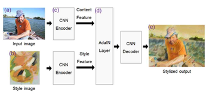
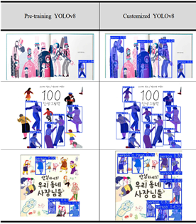

# AR Picture Book Server API

**English**  
This project provides the **server-side API** for the AR Picture Book application.  
It is built with **FastAPI**, integrating **YOLOv8** for image analysis and **OpenAI API** for story, quiz, and TTS generation.  
Unity clients use these APIs to analyze images, generate stories, create quizzes, and compose characters with backgrounds.  

---

**日本語**  
このプロジェクトは、AR絵本アプリケーションの **サーバーAPI** を提供します。  
**FastAPI** で構築され、**YOLOv8** による画像解析、**OpenAI API** を利用したストーリー・クイズ・音声生成を統合しています。  
Unity クライアントは本APIを利用して、画像解析、ストーリー生成、クイズ作成、キャラクターと背景の合成を行います。  

---

## API Specification / API 仕様

### **1. `/upload` - Image Upload & Analysis / 画像アップロードと解析**
Receives an image and analyzes it with YOLOv8. Returns contours, segmented objects, and metadata.  

- **Method:** `POST`  
- **Request (JSON):**
  - `image` (String, Base64) - Uploaded image  
  - `book_id` (int) - Book ID  
- **Response (JSON):**
  - `image_num` (int) - Number of images  
  - `book_id` (int) - Book ID  
  - `image_with_contour` (String, Base64) - Image with contour applied  
  - `yolo_images` (dict) - Segmented image list  
    - `image` (String, Base64) - Individual object image  
    - `label` (String) - Object label  
    - `loc` ([int, int]) - Object position (x, y)  
    - `scale` ([int, int]) - Object size (width, height)  

---

### **2. `/storyMaker` - Story Generation / ストーリー生成**
Generates a story from an uploaded image and recognized objects. Also returns character details.  

- **Method:** `POST`  
- **Request (JSON):**
  - `image` (String, Base64) - Uploaded image  
  - `book_id` (int) - Book ID  
- **Response (JSON):**
  - `story` (String) - Generated story  
  - `characterInfo` (List[dict]) - Character information  
    - `id` (int) - Character ID  
    - `character` (String) - Character name  
    - `status` (String) - Character status  
    - `direction` (String) - Direction  
    - `cloth` (String) - Clothing color  

---

### **3. `/branch` - Image Composition / 画像合成**
Combines a character and background image into one composite.  

- **Method:** `POST`  
- **Request (JSON):**
  - `chara` (String, Base64) - Character image  
  - `bg` (String, Base64) - Background image  
  - `charaPosX` (int) - Character X position  
  - `charaPosY` (int) - Character Y position  
  - `book_id` (int) - Book ID  
- **Response (JSON):**
  - `image` (String, Base64) - Composite image  
  - `book_id` (int) - Book ID  

---

### **4. `/book_load/{book_id}` - Load Book Info / 本情報の取得**
Returns stored information about a specific book.  

- **Method:** `GET`  
- **Response (JSON):**
  - `Book` (Object) - Book information (pages, characters, attributes, etc.)  

---

### **5. `/random_characters` - Random Character Generation / ランダムキャラクター生成**
Generates random character images with size metadata.  

- **Method:** `GET`  
- **200 Success Response (List[JSON], 3 items):**
  - `image` (String, Base64) - Character image  
  - `width` (int) - Image width  
  - `height` (int) - Image height  
- **400 Bad Request Response (JSON):**
  - `message` (String) - Error message  

---

### **6. `/stt` - Speech-to-Text / 音声認識**
Converts story text into audio using OpenAI API.  

- **Method:** `POST`  
- **Request (Form-Data or JSON):**
  - `audio` (File, e.g. `.wav` / `.mp3` in Base64 or binary)  
- **Response (JSON):**
  - `text` (String) - Recognized text  

---

### **7. `/generate` - Text-to-Image Generation / テキストから画像生成**
Generates an image based on input text.  

- **Method:** `POST`  
- **Request (JSON):**
  - `text` (String) - Input description  
- **Response (JSON):**
  - `b64image` (String, Base64) - Generated image  

---

### **8. `/sentence` - Sentence Generation / 文生成**
Creates a sentence based on given character and action.  

- **Method:** `POST`  
- **Request (JSON):**
  - `name` (String) - Character/animal name  
  - `status` (String) - Action status  
  - `lang` (int) - Language code (0: Korean, 1: English)  
  - `level` (int) - Sentence difficulty level  
- **Response (JSON):**
  - `sentence` (String) - Generated sentence

---

## Model Retraining / モデル再学習

**English**  
The illustration style of picture books reduces the performance of YOLO models pre-trained on photographic datasets.  
To address this, **AdaIN (Adaptive Instance Normalization)** style transfer was applied to convert real images into picture-book-like styles (used during retraining, see **Figure 1**).  

- By applying the statistics (mean & std) of picture book illustrations to original images, we generated large amounts of style-transferred data.  
- These augmented images were used to **retrain YOLOv8** for the picture book domain.  
- **Results (Figure 2):** On a test set of 73,361 objects, the retrained model improved detection accuracy by **+21.6%p** compared to the baseline.  
- This demonstrates that **domain-specific data augmentation** significantly improves recognition accuracy in picture books.  

---

## Figures / 図

- **Figure 1. System Architecture with Style Transfer / スタイル転写を含むシステム構成**  
    

- **Figure 2. Retraining Results (Baseline vs. Custom YOLOv8) / 再学習結果（ベースライン vs. カスタムYOLOv8）**  
    

---

**日本語**  
絵本のイラストスタイルは、実写写真ベースの事前学習モデル(YOLO)の性能を低下させます。  
この課題に対処するために、**AdaIN (Adaptive Instance Normalization)** を用いて実写画像を絵本風に変換しました（再学習に使用、**図1**参照）。  

- 絵本の統計量（平均・標準偏差）を適用し、多数のスタイル転写画像を生成  
- これを用いて **YOLOv8 を絵本ドメイン向けに再学習**  
- **結果（図2）:** テストセット 73,361オブジェクトで、事前学習モデル比 **検出精度が21.6%p向上**  
- これは、**ドメイン特化データ拡張**が絵本における物体認識精度改善に有効であることを示しています。  

---

## Tech Stack / 使用技術
- FastAPI (Python)  
- YOLOv8 (Ultralytics)  
- OpenAI API (Story, Quiz, TTS)  
- Uvicorn (ASGI server runtime)  

---

## Notes / 備考
Parts of this README were drafted with the assistance of OpenAI's ChatGPT.  
本READMEの一部は、OpenAI の ChatGPT を利用して作成しました。  

---

## Trademark Notice
YOLOv8 is developed and maintained by Ultralytics.  
OpenAI is a trademark of OpenAI.  
Other names or brands may be claimed as the property of others.  

YOLOv8 は Ultralytics によって開発・管理されています。  
OpenAI は OpenAI の商標です。  
その他の名称やブランドは、各社が所有する場合があります。  

